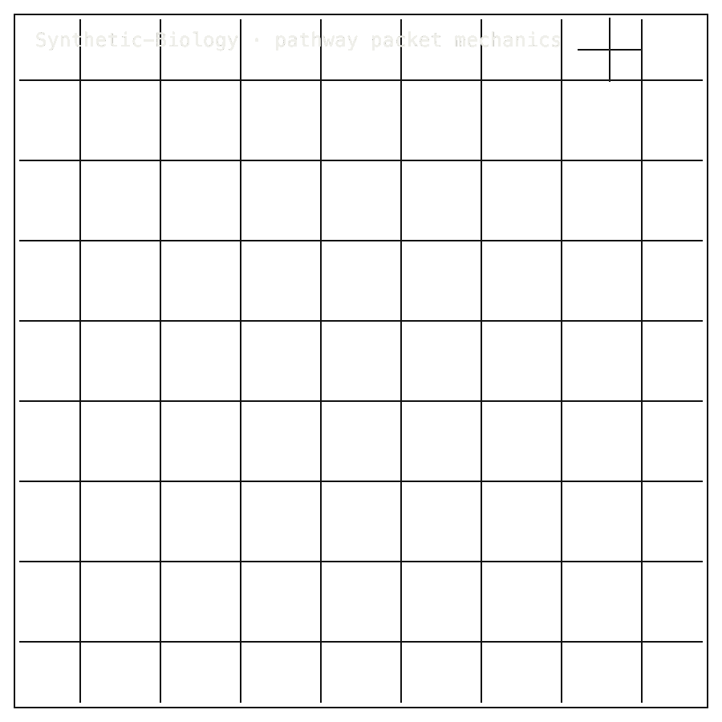

# Synthetic-Biology

## Package Install

Installable package: `python3.11 -m pip install zer0pa-synbio`.
Current release: `0.1.0` on [PyPI](https://pypi.org/project/zer0pa-synbio/).
Source: [Zer0pa/Synthetic-Biology](https://github.com/Zer0pa/Synthetic-Biology/).

```bash
python3.11 -m pip install zer0pa-synbio
```

For full install, smoke, source, and developer commands, [click here](#install-developer-commands-detailed).

---

<table width="100%">
<tr>
<td width="100%" valign="top">
<div><span><b>00 · SYNTHETIC-BIOLOGY</b> · INSILICO · METABOLIC PATHWAYS</span> <span>RESEARCH-READY · WET-LAB OPEN</span></div>
      <h1>Pre-Laboratory <span>Cell Pathway Design</span></h1>
      <p>Synthetic-Biology &middot; <code>zer0pa-synbio</code> 0.1.0 &middot; github.com/Zer0pa/Synthetic-Biology</p>
      <p>An in-silico pipeline for engineering human-milk oligosaccharide biosynthesis in <em>E. coli</em>. Three HMO targets &mdash; <strong>2'-FL, 3'-SL, and DSLNT</strong> &mdash; flow through a seven-stage design stack and exit as SBOL3-attested packets a wet lab can pick up. Every packet carries an explicit <strong><code>scientific_valid: False</code></strong> flag. The design dossier is real and inspectable; the biology has not been confirmed at the bench, and the page does not claim it has.</p>
</td>
</tr>
</table>

<table width="100%">
<tr>
<td width="100%" valign="top">
<figure>
        <div></div>
        <figcaption><b>Scope:</b> in-silico HMO pathway packets. SBOL3 dossiers are inspectable; scientific_valid remains false and no bench confirmation is claimed.</figcaption>
      </figure>
</td>
</tr>
</table>

<table width="100%">
<tr>
<td width="100%" valign="top">
<div><b>01 · THE GAP</b> <span>STRUCTURE VS SCIENCE</span></div>
      <h2>&ldquo;Synthetic-biology design work needs structural status kept separate from scientific validation.&rdquo;</h2>
</td>
</tr>
</table>

<table width="100%">
<tr>
<td width="100%" valign="top">
<div><b>02 · MARKETS</b> <span>USER FIT</span></div>
      <div>
        <div>
          <div><span>Design-toolchain QA</span>  <span>primary</span></div>
          <div><span>SBOL / design packets</span>  <span>fit</span></div>
          <div><span>Pre-wet-lab review</span>  <span>bounded</span></div>
          <div><span>Computational biology QA</span>  <span>adjacent</span></div>
          <div><span>Biofoundry intake</span>  <span>future</span></div>
        </div>
      </div>
      <div>Best fit: design teams sending HMO pathway packets to a wet lab before fermentation, scale-up, or regulatory work begins.</div>
</td>
</tr>
</table>

<table width="100%">
<tr>
<td width="50%" valign="top">
<div><b>03 · VALUE OF MARKET</b></div>
      <div>DESIGN<span>QA</span></div>
      <div>Hash-bound design packets with <b>SBOL3 attestation and a scientific-validity flag that travels with every HMO target.</b></div>
</td>
<td width="50%" valign="top">
<div><b>04 · INSIGHT</b></div>
      <h2>Design packets pass shape checks; the biology is <span>not yet proven.</span></h2>
</td>
</tr>
</table>

<table width="100%">
<tr>
<td width="50%" valign="top">
<div><b>05.0 · CURRENT TECH</b> <span>DESIGN ARTIFACT MIX</span></div>
        <p>Synthetic-biology design today scatters across SBOL files, pathway hypotheses, COBRApy model dumps, structure-prediction outputs, and wet-lab planning notes. The bench team receives a folder of attachments and reconstructs intent from filenames, version drift, and email threads.</p>
</td>
<td width="50%" valign="top">
<div><b>05.1 · OUR TECH</b> <span>STRUCTURAL CHECK + COMMITTED FALSE</span></div>
        <p>This pipeline ships a single packet per HMO target. <strong>3/3 structural PASS</strong> covers 2'-FL, 3'-SL, and DSLNT through schema, boundary, license-class, and SBOL3 attestation checks; the same packet commits <code>scientific_valid: False</code>. A wet lab receives one object that names its targets, its constraints, and the line between what was designed and what was tested.</p>
</td>
</tr>
</table>

<table width="100%">
<tr>
<td width="100%" valign="top">
<div><b>05.2 · BENCHMARKS</b> <span>STRUCTURAL &middot; COMMITTED PACKETS</span></div>
      <div>
        <div>
          <div><span>HMO targets</span><b>3/3</b><small>structural PASS</small></div>
          <div><span>CPU tests</span><b>256</b><small>0 regressions</small></div>
          <div><span>Checks</span><b>23</b><small>Tier A/B/C list</small></div>
          <div><span>PyPI</span><b>0.1.0</b><small>stale pending</small></div>
        </div>
        <div>
          <div><span>structural check</span>  <span>3/3 PASS</span></div>
          <div><span>scientific HMO</span>  <span>false</span></div>
          <div><span>release wording</span>  <span>stale</span></div>
        </div>
      </div>
      <div><b>Current status:</b> structural conformance only &middot; PyPI 0.1.0 stale-pending &middot; <code>scientific_valid: False</code> on every committed HMO packet.</div>
</td>
</tr>
</table>

<table width="100%">
<tr>
<td width="34%" valign="top">
<div><b>06 · MEASUREMENT</b> <span>STRUCTURAL VERIFY &middot; 23 CHECKS</span></div>
      <h2>23 checks confirm three HMO design packets are well-formed, <span>not bench-tested.</span></h2>
</td>
<td width="66%" valign="top">
<div><b>06.1 · COMPARATIVE / BOUNDED VALIDATION &middot; STRUCTURAL VS SCIENTIFIC STATUS</b></div>
      <div>
        <div>
          <div><span>structural check</span>  <span>3/3 PASS &middot; HMO triple</span></div>
          <div><span>CPU test suite</span>  <span>256 PASS &middot; 0 regressions</span></div>
          <div><span>scientific HMO validation</span>  <span>false &middot; committed packet</span></div>
          <div><span>public release wording</span>  <span>stale v0.1.0</span></div>
        </div>
      </div>
      <div>The 2'-FL, 3'-SL, and DSLNT packets clear schema, boundary, license-class, and SBOL3 attestation under 23 tiered checks. <b>Structural conformance is real; wet-lab HMO synthesis is not presented in this release.</b></div>
</td>
</tr>
</table>

<table width="100%">
<tr>
<td width="100%" valign="top">
<div><b>07 · KEY METRICS</b> <span>SYNBIO V0.1 &middot; STRUCTURAL-ONLY ANCHORS</span></div>
</td>
</tr>
</table>

<table width="100%">
<tr>
<td width="100%" valign="top">
<div><b>07.1 · STRUCTURAL CHECK</b></div>
      <div>3<span>/3</span></div>
      <div>2'-FL, 3'-SL, DSLNT &middot; <b>structural pass on all three HMO targets</b></div>
</td>
</tr>
</table>

<table width="100%">
<tr>
<td width="100%" valign="top">
<div><b>07.2 · CPU TESTS</b></div>
      <div>256<span>PASS</span></div>
      <div><code>pytest tests/</code> &middot; <b>0 regressions, 59 GPU calls skipped</b></div>
</td>
</tr>
</table>

<table width="100%">
<tr>
<td width="100%" valign="top">
<div><b>07.3 · CHECK LIST</b></div>
      <div>23</div>
      <div>Tier A, B, and C checks loaded at packet build</div>
</td>
</tr>
</table>

<table width="100%">
<tr>
<td width="100%" valign="top">
<div><b>07.4 · PYPI RELEASE</b></div>
      <div>0.1.0<span>STALE</span></div>
      <div><code>zer0pa-synbio</code> &middot; <b>connected, stale pending fresh release</b></div>
</td>
</tr>
</table>

<table width="100%">
<tr>
<td width="100%" valign="top">
<div><b>07.5 · SCIENTIFIC HMO</b></div>
      <div>false</div>
      <div>Packet flag &middot; <b><code>scientific_valid: False</code> committed on every HMO target</b></div>
</td>
</tr>
</table>

<table width="100%">
<tr>
<td width="100%" valign="top">
<div><b>08 · DETERMINISM</b> <span>STRUCTURAL SHA &middot; NOT BIOLOGY</span></div>
      <h2>Structural hashes repeat; scientific validity is <span>not determined.</span></h2>
</td>
</tr>
</table>

<table width="100%">
<tr>
<td width="66%" valign="top">
<div><b>08.1 · WHAT DETERMINISTIC MEANS</b> <span>STRUCTURAL SHA + VALIDITY FLAGS</span></div>
      <p>Each HMO design is hashed across <strong>three target shapes</strong> &mdash; 2'-FL, 3'-SL, and DSLNT &mdash; over envelope schema, boundary SHA, SBOL3 attestation, license-class enforcement, and the tiered check list. Re-running the pipeline produces the same SHA. That is what the <code>3/3 PASS</code> measures.</p>
      <p>Structural replay does not promote any biological claim. The <code>scientific_valid: False</code> flag stays committed on every packet until a wet-lab result is independently produced and attached under a separate validation contract. Determinism is <em>per-envelope-shape, structural only</em>.</p>
</td>
<td width="34%" valign="top">
<div><b>08.2 · THE FIDELITY GAP</b></div>
      <span>Honest Blocker &middot;</span>
      <p>The public 0.1.0 PyPI surface remains stale-pending while HMO packets at <code>validation/hmo-seed-evidence/&#123;2pFL,3pSL,DSLNT&#125;/RESULT.md</code> report <code>scientific_valid: False</code> in stub mode. The structural check is real; <strong>wet-lab HMO synthesis, RFdiffusion closure, and a fresh release are still ahead.</strong></p>
</td>
</tr>
</table>

<table width="100%">
<tr>
<td width="33%" valign="top">
<div><b>09</b> </div>
      <h2>FIVE PATHS FROM ONE <span>DESIGN PACKET.</span></h2>
</td>
<td width="67%" valign="top">
<div><b>09.1 · THIS REPO'S AMBITION</b></div>
      <p>The ambition is a credible front end for synthetic-biology design &mdash; one packet per pathway, carrying its sequence context, boundary constraints, license class, naming history, and validity status. A bioengineer should be able to pick it up on a Tuesday morning and walk into the lab knowing exactly what is designed and what is not yet proven.</p>
</td>
</tr>
</table>

<table width="100%">
<tr>
<td width="33%" valign="top">
<div><b>09.2 · WHAT WORKS NOW</b></div>
        <h2>Three HMO design packets ship with structural conformance, SBOL3 attestation, and explicit validity flags on every target.</h2>
</td>
<td width="67%" valign="top">
<div><b>09.3 · WHAT'S STILL OPEN</b></div>
        <h2>Wet-lab HMO synthesis, GPU-bound structural calls, and a fresh PyPI release remain ahead of this version.</h2>
</td>
</tr>
</table>

<table width="100%">
<tr>
<td width="100%" valign="top">
<div><b>09.4</b> &middot; DESIGN REVIEW &middot; NEAR-TERM (12&ndash;24 MO)</div>
      <div>Wet labs stop redoing design review</div><div>A bioengineering team that receives a packet with sequence context, license class, and validity flags already attached can spend its Monday morning planning cloning, not re-checking whether the upstream design was even meant to be tested yet.</div>
</td>
</tr>
</table>

<table width="100%">
<tr>
<td width="100%" valign="top">
<div><b>09.5</b> &middot; INFANT NUTRITION &middot; NEAR-TERM (12&ndash;24 MO)</div>
      <div>HMO programs gain a planning standard</div><div>Infant-nutrition and prebiotic teams chasing 2'-FL, 3'-SL, and DSLNT can compare external design proposals against an open structural template. Vendor pitches become easier to read because the pipeline names what was checked and what was not.</div>
</td>
</tr>
</table>

<table width="100%">
<tr>
<td width="100%" valign="top">
<div><b>09.6</b> &middot; BIOFOUNDRY INTAKE &middot; MID-TERM (24&ndash;48 MO)</div>
      <div>Biofoundries take work from packets</div><div>A biofoundry can accept design jobs as structured packets instead of slide decks and PDFs. Intake becomes a checklist against the packet's declared status, which shortens the conversation between the design house and the strain-build team.</div>
</td>
</tr>
</table>

<table width="100%">
<tr>
<td width="100%" valign="top">
<div><b>09.7</b> &middot; PROCUREMENT &middot; MID-TERM (24&ndash;48 MO)</div>
      <div>Buyers separate design risk from biology risk</div><div>A pharma or food-ingredient buyer evaluating a synthetic-biology proposal can ask for design-side dossiers before any wet-lab commit. Procurement gains a way to price design maturity and bench risk as two different line items.</div>
</td>
</tr>
</table>

<table width="100%">
<tr>
<td width="100%" valign="top">
<div><b>09.8</b> &middot; INDUSTRY STANDARD &middot; PARADIGM (48 MO+)</div>
      <div>Synthetic biology adopts handoff packets</div><div>If structured design packets become how synthetic-biology programs travel between teams, the field inherits a shared object that survives staff turnover, vendor changes, and regulatory review. The pathway design becomes a durable asset, not a slide.</div>
</td>
</tr>
</table>

---

<a id="install-developer-commands-detailed"></a>

## Install / Developer Commands Detailed

<!-- INSTALL-DX:START -->
#### Package Install

Installable package: `python3.11 -m pip install zer0pa-synbio`.
Current release: `0.1.0` on [PyPI](https://pypi.org/project/zer0pa-synbio/).
Source: [Zer0pa/Synthetic-Biology](https://github.com/Zer0pa/Synthetic-Biology/).

```bash
python3.11 -m pip install zer0pa-synbio
```

Import smoke:

```bash
python3.11 - <<'PY'
import importlib.metadata as md
import zer0pa_synbio

print("zer0pa-synbio", md.version("zer0pa-synbio"))
PY
```


CLI smoke:

```bash
synbio --help
```

Install success only proves package acquisition/import. Product scope, stale PyPI state, platform limits, and blockers remain in the front-door sections below.
- Use the hyphenated PyPI name for install; PyPI copy is stale pending a fresh release.
<!-- INSTALL-DX:END -->
